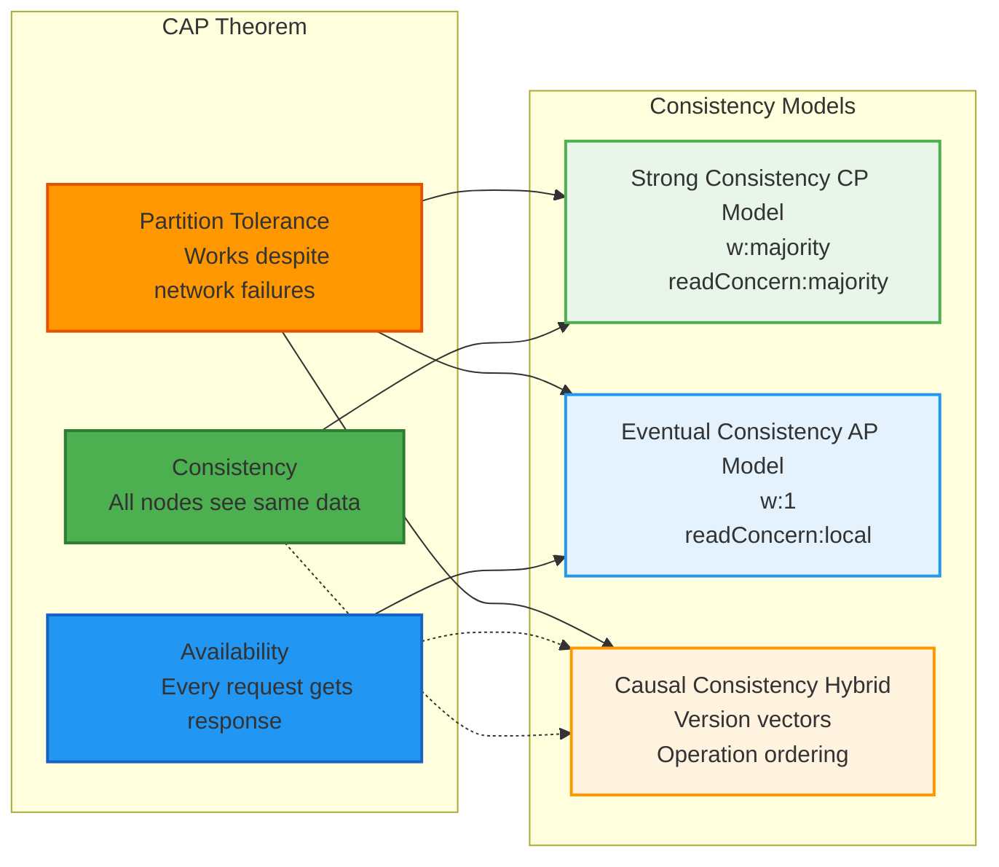

# MongoDB Distributed Systems Lab

A comprehensive hands-on laboratory project demonstrating distributed database concepts using MongoDB replica sets, including replication strategies, consistency models, transaction patterns, and real-time monitoring.

## 🎯 Overview
This lab project provides practical experience with MongoDB's distributed systems capabilities through four comprehensive experiments exploring replication strategies, consistency models, transaction patterns, and real-time monitoring of replica set health.

---
## 📊 Architecture Diagrams
### Diagram 1: MongoDB Replica Set Architecture

### Diagram 2: CAP Theorem Trade-offs

### Diagram 3: Primary Failover Process


### Diagram 4: Lab Experiment Flow

## 📁 Lab Structure
```
mongodb-distributed-lab/
├── replication_experiments.py      
├── consistency_experiments.py      
├── transaction_analysis.py         
├── monitoring_dashboard.py         
├── populate_data.py                
├── requirements.txt                
├── docker-compose.yml              
└── README.md                       
```

---

## ⚙️ Prerequisites

### Required Software
- Docker and Docker Compose (v20.10+)
- Python 3.8 or higher
- pip package manager

### System Requirements
- 4GB RAM minimum (8GB recommended)
- 10GB free disk space

---

## Part A: Installation & Setup

### Step 1: Install Python Dependencies
```bash
pip install -r requirements.txt
```

### Step 2: Start MongoDB Replica Set
Create a docker-compose.yml file with three MongoDB nodes (mongo1, mongo2, mongo3) configured as a replica set named "rs0".
```bash
docker-compose up -d
```

### Step 3: Initialize Replica Set
Connect to the primary node and initialize the replica set with three members.
```bash
docker exec -it mongo1 mongosh
```
Run initialization commands and verify the cluster status.

---

## Lab Experiments

### Part B: Replication Strategies
**Experiments:**
- Write Concerns - Compare w:1, w:majority, and w:3 configurations
- Leader-Follower Replication - Observe replication lag between primary and secondaries
- Primary Failover - Simulate automatic election when primary fails
- Multi-Primary Discussion - Conceptual comparison with leaderless systems

```bash
# Run replication experiments
python replication_experiments.py
```
**Interactive Steps:**
- Follow prompts to execute each experiment sequentially
- For failover experiment, manually stop primary node when instructed
- Observe automatic election and topology changes

---

### Part C: Consistency Models
**Experiments:**
- Strong Consistency (CP Model) - w:majority, readConcern:majority
- Eventual Consistency (AP Model) - w:1, readConcern:local with stale reads demonstration
- Causal Consistency (Bonus) - Lamport clocks and operation ordering

```bash
# Run consistency experiments
python consistency_experiments.py
```
**Interactive Steps:**
- Press Enter to proceed through each consistency model
- Observe CAP theorem trade-offs in real-time
- Compare consistency vs availability behaviors

---

### Part D: Transaction Patterns
**Demonstrations:**
- ACID Transaction Pattern - E-commerce order processing with atomic operations
- Saga Pattern - Same workflow with compensating transactions
- Comparison Analysis - Side-by-side evaluation of both approaches

```bash
# Run transaction analysis
python transaction_analysis.py
```
**Covers:**
- ACID properties demonstration
- Saga pattern with compensation logic
- Trade-offs between transaction models

---

### Bonus: Real-Time Monitoring
**Features:**
- Live replication lag visualization
- Node health status timeline
- Auto-refresh dashboard with matplotlib

```bash
# Launch real-time dashboard
python monitoring_dashboard.py

# Quick status check
python monitoring_dashboard.py --status
```

---

## Key Concepts Covered

### Distributed Systems
- CAP Theorem (Consistency, Availability, Partition Tolerance)
- Replication strategies and consensus protocols
- Eventual consistency and convergence
- Network partitions and fault tolerance

### MongoDB Architecture
- Replica sets and primary-secondary topology
- Write concerns and read preferences
- Read concerns and consistency levels
- Oplog-based replication

### Transaction Models
- ACID properties and distributed transactions
- Saga pattern with compensating transactions
- Trade-offs between consistency and availability

---

## 🔧 Troubleshooting

### Common Issues

**Connection Timeout**
- Wait 15–20 seconds after replica set initialization for election to complete

**Replica Set Not Initialized**
- Verify cluster status and re-initialize if needed

**Port Already in Use**
- Check and modify ports in docker-compose.yml or stop conflicting services

**Python Module Not Found**
- Reinstall dependencies from requirements.txt

**Docker Network Issues**
- Restart containers and prune networks

### Verification Commands
```bash
# Check containers
docker ps

# Check replica set status
docker exec -it mongo1 mongosh --eval "rs.status()"

# View logs
docker logs mongo1
```

---

## Requirements File
```
pymongo==4.6.0
docker==7.0.0
matplotlib==3.8.2
numpy==1.26.2
```

---

## 👤 Author
**Akshay Channapla Udaya Kumar**  
Educational project for distributed systems learning.
